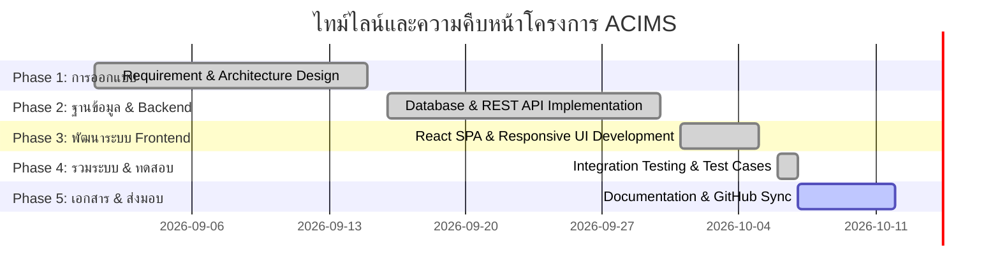

# รายงานสถานะความคืบหน้าของโครงการ (Project Phase Status Report)
**โครงการ:** ระบบบริหารจัดการข้อมูลผลงานวิชาการ (ACIMS - Academic Information Management System)  
**คณะวิทยาศาสตร์และเทคโนโลยี มหาวิทยาลัยเทคโนโลยีราชมงคลกรุงเทพ**  
**วันที่รายงาน:** 7 ตุลาคม 2569 (07/10/2026)

---

## 📊 สรุปภาพรวมสถานะโครงการ (Executive Summary)

โครงการ **ACIMS** ได้รับการพัฒนาเพื่อรองรับการจัดเก็บ ตรวจสอบ ประมวลผล และวิเคราะห์ข้อมูลผลงานวิชาการของคณาจารย์ เพื่อตอบสนองเกณฑ์การประกันคุณภาพการศึกษาตามมาตรฐาน **AUN-QA (Criterion 6: Academic Staff Quality)**

ณ วันที่ **7 ตุลาคม 2569** สถานะการดำเนินงานปัจจุบันอยู่ที่ **สิ้นสุด Phase 4 (เสร็จสมบูรณ์ 100%)** และกำลังดำเนินงานใน **Phase 5 (85%)**

---

## 🔍 รายละเอียดความก้าวหน้าในแต่ละ Phase

### 🟢 Phase 1: การวิเคราะห์และออกแบบระบบ (System Analysis & Architecture Design)
- **สถานะ:** เสร็จสมบูรณ์ (100%)
- **ผลลัพธ์:**
  - กำหนด Use Case การใช้งานครอบคลุม 4 กลุ่มผู้ใช้ (Admin, หัวหน้าภาควิชา, หัวหน้าหลักสูตร, อาจารย์ประจำหลักสูตร)
  - ออกแบบโครงสร้างฐานข้อมูลเชิงสัมพันธ์ 8 ตาราง (Normalized 3NF) รองรับ Relation Many-to-Many สำหรับบทบาทผู้ใช้
  - กำหนด Workflow การตรวจรับผลงานวิชาการ (รอพิจารณา -> อนุมัติแล้ว / ส่งกลับเพื่อแก้ไข)

### 🟢 Phase 2: การพัฒนาฐานข้อมูลและ API ระบบหลังบ้าน (Database & Backend REST API)
- **สถานะ:** เสร็จสมบูรณ์ (100%)
- **ผลลัพธ์:**
  - ติดตั้งฐานข้อมูล PostgreSQL (`schema.sql` และ `seed.sql`)
  - พัฒนาระบบ Authentication ด้วย JWT และการแฮชรหัสผ่านด้วย `bcryptjs`
  - พัฒนาระบบ Role-Based Access Control (RBAC Middleware)
  - พัฒนา REST API ครบถ้วนตามมาตรฐาน:
    - `/api/auth`: เข้าสู่ระบบและตรวจสอบโปรไฟล์
    - `/api/works`: จัดการผลงานวิชาการ, อัปโหลดไฟล์เอกสาร, พิจารณาอนุมัติ/ส่งกลับ
    - `/api/users`: จัดการผู้ใช้และกำหนดสิทธิ์
    - `/api/stats`: คำนวณสถิติภาพรวมเพื่อประเมินเกณฑ์ AUN-QA
  - ระบบตรวจสอบขนาดและประเภทไฟล์ (Multer - ป้องกันไฟล์แปลกปลอมและจำกัดขนาด 25MB)

### 🟢 Phase 3: การพัฒนาระบบส่วนติดต่อผู้ใช้ (Frontend SPA Development)
- **สถานะ:** เสร็จสมบูรณ์ (100%)
- **ผลลัพธ์:**
  - พัฒนาระบบหน้าบ้านด้วย React 18, Vite, และ Tailwind CSS
  - มีระบบรักษาความปลอดภัย Client Route Guard (Protected Routes ตามสิทธิ์)
  - พัฒนาหน้าจอการทำงานหลัก 7 หน้าจอ:
    1. **Login Page:** เข้าสู่ระบบ พร้อมปุ่มจำลองการเข้าสู่ระบบ 4 บทบาท
    2. **Dashboard Page:** สรุปตัวชี้วัด AUN-QA Criterion 6 และกราฟสถิติ
    3. **Add Work Page:** แบบฟอร์มส่งผลงานวิชาการ รองรับการ Drag & Drop ไฟล์เอกสาร
    4. **My Works Page:** หน้าติดตามสถานะผลงานของอาจารย์ และดูความคิดเห็นการส่งกลับ
    5. **Review Page:** หน้าตรวจสอบและอนุมัติผลงานสำหรับหัวหน้าหลักสูตร/หัวหน้าภาควิชา
    6. **Role Management Page:** หน้าจัดการสิทธิ์ผู้ใช้งานสำหรับผู้ดูแลระบบ
    7. **Search Page:** หน้าค้นหาและสืบค้นผลงานวิชาการตามปี หลักสูตร และประเภท

### 🟢 Phase 4: การรวมระบบและการทดสอบระบบ (System Integration & Automated Testing)
- **สถานะ:** เสร็จสมบูรณ์ (100%)
- **ผลลัพธ์:**
  - สร้างชุดทดสอบอัตโนมัติ `backend/test_api.js`
  - ครอบคลุมกรณีทดสอบในบทที่ 3 (ตารางที่ 3.9, 3.10, 3.12, 3.13, 3.14, 3.15)
  - ผ่านการทดสอบทั้งหมด (Positive & Negative Test Cases เช่น ตรวจสอบการส่งกลับโดยไม่กรอกเหตุผล, อาจารย์พยายามเข้าถึงฟังก์ชันแอดมิน ฯลฯ)

### 🟡 Phase 5: การจัดทำเอกสารและเตรียมนำขึ้นระบบจริง (Documentation, Deployment & Delivery)
- **สถานะ:** กำลังดำเนินการ (85%)
- **สิ่งที่ดำเนินการแล้ว ณ วันที่ 7 ตุลาคม 2569:**
  - จัดทำเอกสารสรุปความคืบหน้าของโครงการ (`PHASE_STATUS.md`)
  - อัปเดตคู่มือหลักของโครงการ (`README.md`)
  - จัดเตรียมไฟล์โครงแบบ `.env.example` และ `.gitignore`
  - จัดเตรียม Git Commit และเตรียม Push ขึ้น GitHub Repository
- **สิ่งที่ต้องดำเนินการถัดไป:**
  - จัดทำคู่มือการใช้งานระบบสำหรับผู้ใช้ (User Manual)
  - ทดสอบระบบบนสภาพแวดล้อมจำลองการทำงานจริง (Staging Environment)

---
*บันทึกข้อมูลโดยระบบอัตโนมัติ ณ วันที่ 7 ตุลาคม 2569*
